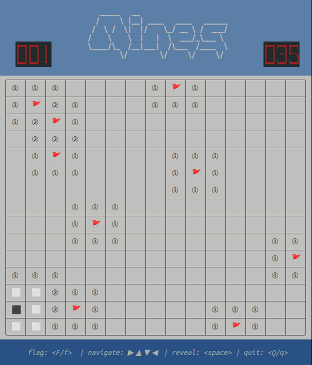

# go-mines

[](https://github.com/jedib0t/go-mines/actions?query=workflow%3ACI+event%3Apush+branch%3Amain)

An implementation of Minesweeper for the command-line in GoLang.

# Install

You can download the latest release for your OS [here](https://github.com/jedib0t/go-mines/releases/latest).

### Install Using GoLang
```
go install github.com/jedib0t/go-mines
```

# Sample



# Usage

```
go-mines: A GoLang implementation of the Minesweeper game.

Version: dev

Flags
=====
  -cols int
    	Number of Columns (max: 80) (default 15)
  -demo
    	Play automatically? (this cheats to win)
  -help
    	Show this help-text?
  -mines int
    	Number of Mines (max: 50% of grid) (default 40)
  -refresh-rate int
    	Refresh-rate per second (default 20)
  -rows int
    	Number of Rows (max: 40) (default 15)
  -seed int
    	Randomizer Seed value (will use current time if ZERO)
```

Note: for Windows, you may want to configure your terminal to use a typeface or
font that supports all the Unicode symbols used in this game. An example (that
has been verified to work) would be Ubuntu Mono.

